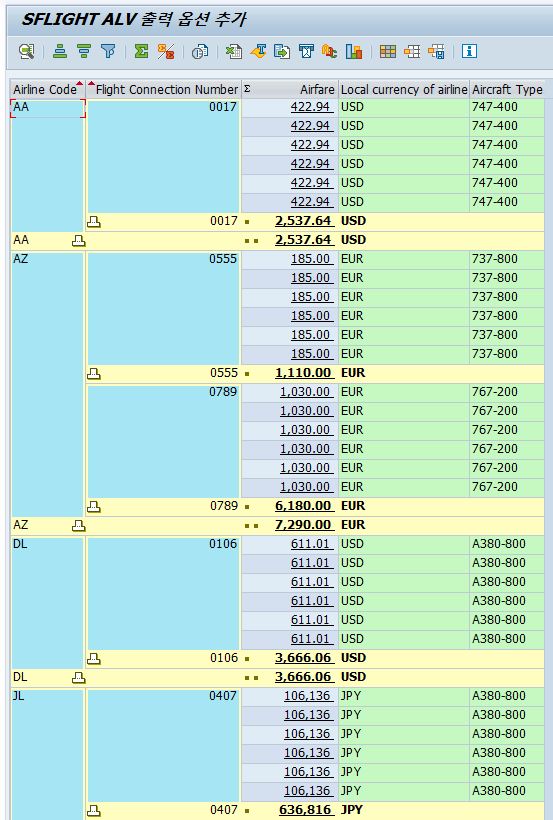

## ALV 출력 - SFLIGHT 테이블

- fieldcatalog-key = 'X'
CARRID, CONNID를 키 필드로 지정해서 ALV에서 기본 정렬 기준이 되게 하고, 서브토탈·그룹 합계 계산 시 그룹핑 기준 필드로 사용함.
​

- fieldcatalog-do_sum = 'X'
PRICE 필드를 합계 계산 대상으로 지정해서, 정렬·서브토탈 설정에 따라 CARRID/CONNID별 운임 합계를 자동으로 표시하게 함.
​

- fieldcatalog-hotspot = 'X'
PRICE 컬럼을 핫스팟(밑줄 하이퍼링크처럼 클릭 가능한 셀)으로 만들어서, 추후 USER_COMMAND 이벤트에서 셀 클릭 시 추가 동작(예: 상세 팝업, 다른 화면 호출 등)을 구현할 수 있도록 함.
​

