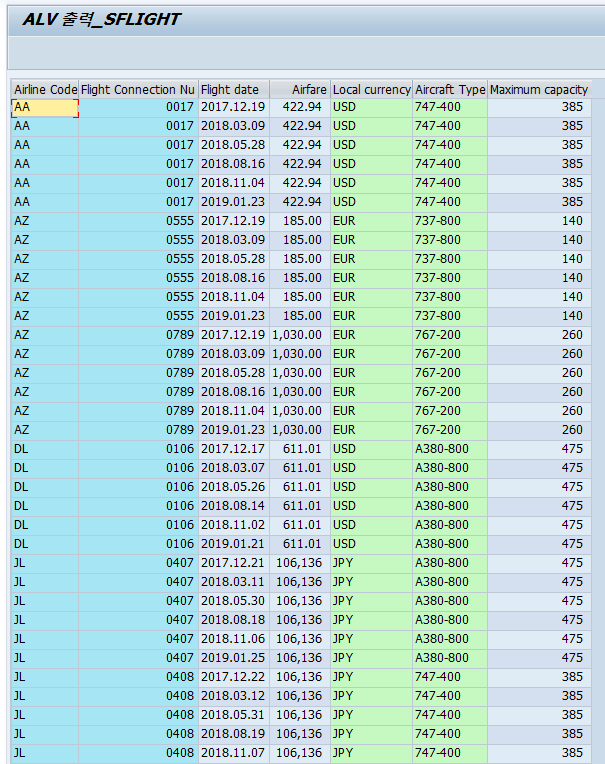

## ALV 출력 - SFLIGHT 테이블

- SFLIGHT 테이블 데이터 조회
- `CONNID` 필드에 대해 `fieldcatalog-lzero = 'X'`를 설정해, 값이 `0017`처럼 앞자리가 0인 경우에도 ALV에서 0이 유지되도록 출력함.
- `PRICE` 필드는 `fieldcatalog-cfieldname = 'CURRENCY'`로 통화키와 연결해, 통화 단위에 맞는 금액 형식으로 표시되도록 설정함.
- 필드카탈로그에서 CURRENCY·PLANETYPE 등 컬럼에 emphasize = 'C500'을 설정해 해당 필드들을 연두색(초록 계열)으로 강조 표시함.

